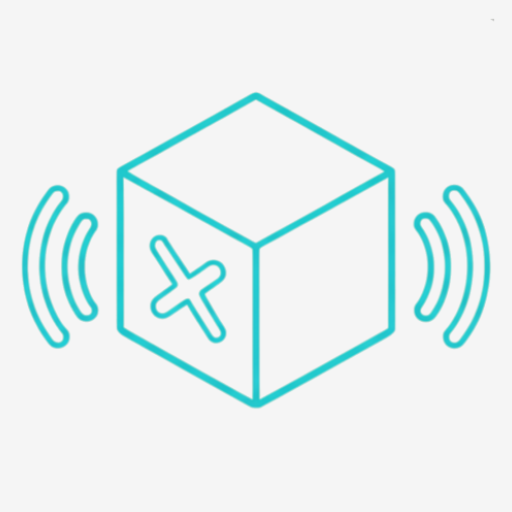
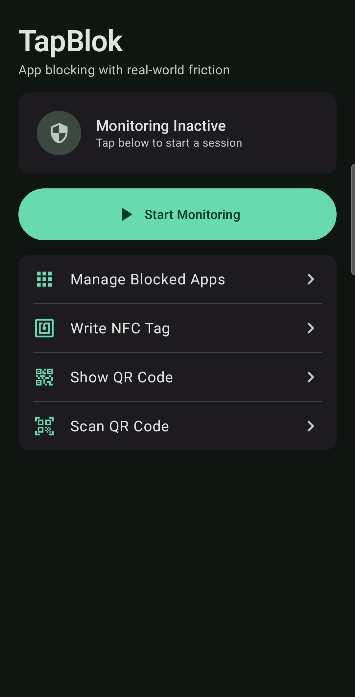
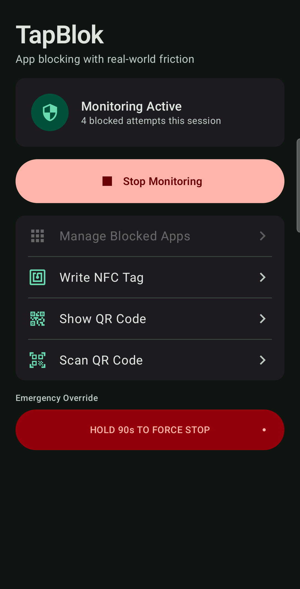
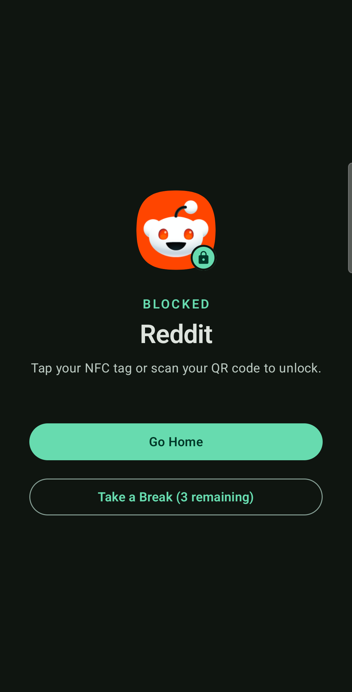
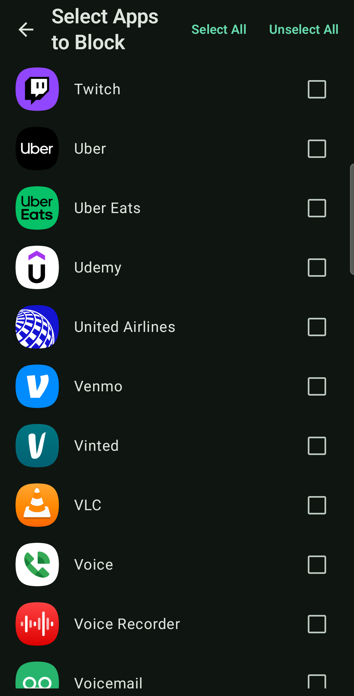
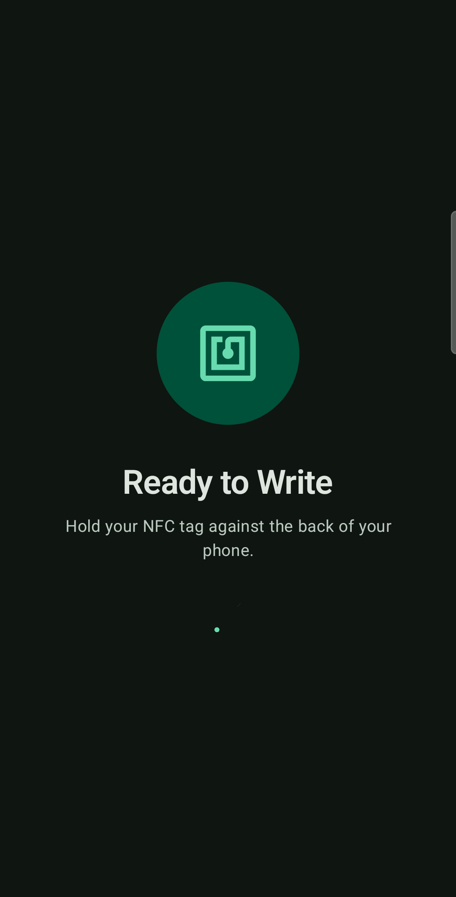
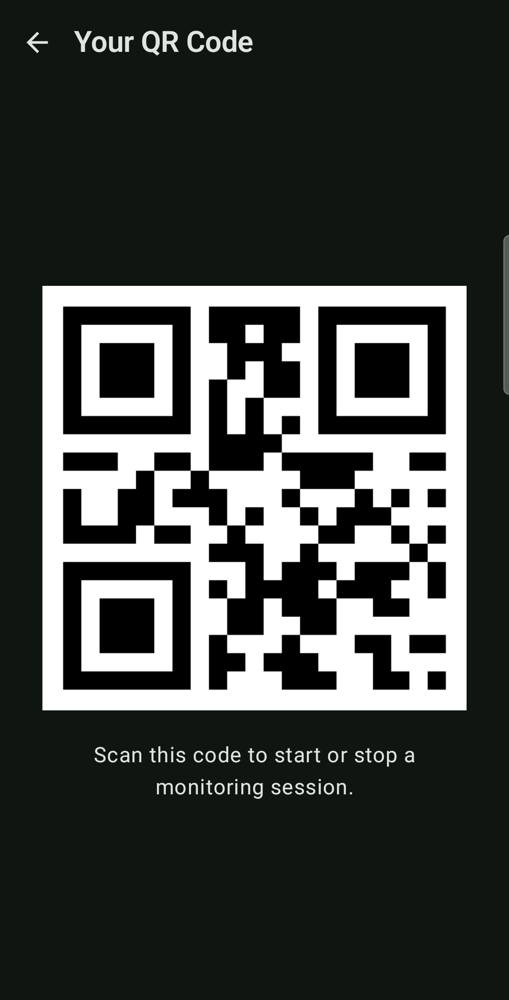

<p align="center">
  
</p>

<h1 align="center">Tether</h1>

<p align="center">
  <strong>Block distracting apps — the physical way.</strong>
</p>

<p align="center">
  Tether makes you earn your screen time back. Start a focus session and your chosen apps are locked — the only way out is scanning an NFC tag or QR code you've placed somewhere inconvenient. No digital bypass. No "just this once."
</p>

<p align="center">
  <a href="https://github.com/cajdata/Tether/releases/latest">
    
  </a>
</p>

<p align="center">Android 7.0+ &nbsp;·&nbsp; Apache 2.0 &nbsp;·&nbsp; Free, no subscription</p>

---

<p align="center">
  
  &nbsp;&nbsp;
  
  &nbsp;&nbsp;
  
</p>

<p align="center">
  
  &nbsp;&nbsp;
  
  &nbsp;&nbsp;
  
</p>

---

## ✨ Features

- **🏷️ NFC Tag Support** — Write Tether's token to any NDEF-compatible tag (NTAG213/215/216, under $1 each). Tap to toggle a session.
- **📷 QR Code Support** — Generate a QR code in-app and print it. Hide it somewhere that requires real effort to reach. Every install gets its own unique code.
- **🔐 Strict Mode** — Sessions can only be stopped by scanning with Tether open. Scanning on a block screen grants a short timed unlock for that one app instead of ending the session.
- **🔒 Block Any App** — Choose any launchable app on your device. Critical system apps (dialer, camera, settings, launcher) are permanently excluded so you can't lock yourself out.
- **☕ Smart Breaks** — Take five-minute breaks without ending the session. Choose how many per session (0–5) in Settings.
- **🔁 Boot Persistence** — If your device restarts mid-session, Tether picks right back up.
- **🚨 Emergency Override** — Lost your tag? A hold-to-stop last resort. Set the hold anywhere from 30 seconds to 15 minutes, or disable it entirely for strict sessions.
- **⏰ Scheduled Blocking** — Sessions start (and optionally stop) automatically on the days and times you choose.
- **🤖 Automation Ready** — Opt-in broadcast actions let Tasker, MacroDroid, or Samsung Routines start and stop sessions.
- **📊 Attempt Counter** — See how many times you tried to open a blocked app. Accountability you can't ignore.
- **⚡ App Shortcut** — Long-press the Tether icon to start a session instantly.
- **🔓 Open Source** — Every line of code is on GitHub. No black boxes, ever.
- **🆓 Completely Free** — No subscription, no in-app purchases, no tracking, no cloud.

---

## 🚀 Getting Started

1. **Install** — Download the APK from the [latest release](https://github.com/cajdata/Tether/releases/latest) and install it.
2. **Grant permissions** — Usage Access and Display Over Other Apps are required. Tether will prompt you.
3. **Pick your apps** — Tap "Manage Blocked Apps" and select the apps you want to block.
4. **Set up your unlock method** — Write an NFC tag in-app, or generate a QR code and print it.
5. **Start a session** — Tap "Start Monitoring" and put the tag somewhere out of arm's reach.

### NFC Tags

Any NDEF-compatible NFC tag works. Personally, I use and recommend these [NTAG215 NFC sticker tags (black, adhesive)](https://amzn.to/418E7nb) — they're low-profile, stick well, and the black color blends in wherever you put them. A pack of 10 is a few dollars.

1. Tap **Write NFC Tag** in the app
2. Hold your tag to the back of your phone
3. Done — place the tag somewhere that adds friction (not next to your phone)

> As an Amazon Associate I earn from qualifying purchases.

### QR Code

1. Tap **Show QR Code** in the app
2. Screenshot or print it
3. Put it somewhere that requires getting up — another room, your wallet, your desk drawer

> **Upgrading from before v1.5.0?** QR codes are now unique per install. Print a new one — codes from older versions (or other phones) no longer work.

### Strict Mode

Enable **Settings → Strict Mode** and a running session can only be stopped by opening Tether first, then scanning your tag or QR code. Scanning on a block screen doesn't end the session — it unlocks just that one app for a limited time (1–30 minutes, your choice). Combine with zero breaks and a disabled emergency override for maximum friction.

### Scheduled Blocking

Open **Settings → Scheduled Blocking** to start sessions automatically — pick a start time, an optional auto-stop time, and the days of the week. Overnight windows (e.g. 22:00–07:00) work, and schedules survive reboots.

### Automation (Tasker, MacroDroid, Samsung Routines)

Enable **Settings → Allow automation apps**, then have your automation app send a broadcast:

```
# Start a session
am broadcast -n com.rahul100ni.tether/.ScheduleReceiver -a com.rahul100ni.tether.SCHEDULE_START

# Stop a session
am broadcast -n com.rahul100ni.tether/.ScheduleReceiver -a com.rahul100ni.tether.SCHEDULE_STOP
```

In Tasker: **System → Send Intent** with Action `com.rahul100ni.tether.SCHEDULE_START` (or `SCHEDULE_STOP`), Package `com.rahul100ni.tether`, Class `com.rahul100ni.tether.ScheduleReceiver`, Target `Broadcast Receiver`. This opens up location-based blocking, calendar-triggered sessions, and similar automations. External triggers are ignored unless the toggle is on.

---

## 🏗️ Architecture

Built entirely in Kotlin using modern Android development practices.

| Component | Purpose |
|---|---|
| `AppMonitoringService` | Foreground service — polls the foreground app every second, launches `BlockingActivity` on a match |
| `BlockingActivity` | Full-screen overlay shown when a blocked app is detected |
| `AppSelectionActivity` | Lets users pick which apps to block |
| `NfcHandlerActivity` | Toggles the service when a Tether NFC tag is scanned |
| `NfcWriteActivity` | Writes Tether's NDEF record to an NFC tag |
| `QrCodeActivity` | Generates and displays the unlock QR code |
| `BootCompletedReceiver` | Restarts the service after device reboot if a session was active |

**Stack:** Jetpack Compose · Material 3 · Room · Kotlin Coroutines · ZXing · Coil

---

## 🤝 Contributing

Contributions are welcome.

1. Fork the repo
2. Create a feature branch
3. Commit your changes
4. Open a Pull Request

---

## 📄 License

Apache 2.0 — see [LICENSE](LICENSE) for details.

---

<p align="center">
  Made in Denver, CO 🏔️
</p>
